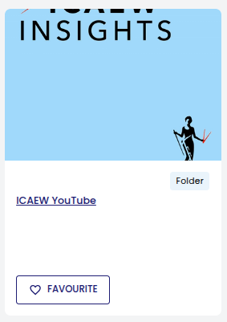
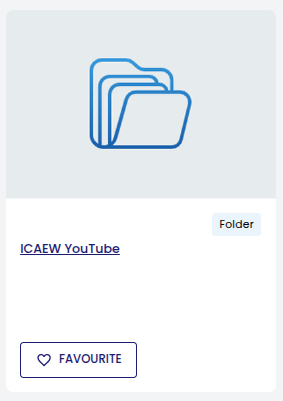

# Preservica Folder Thumbnail Refresh

## Background

In Preservica's NGI and Portal interfaces, folders inherit thumbnails from their child assets. This makes folders visually indistinguishable from documents, which creates confusion and undermines navigation - users cannot immediately tell whether an item is a container or a file.

| Problem | Fix |
|:---:|:---:|
|  |  |
| Folder displays a child asset's thumbnail | Folder displays a clear, recognisable folder icon |

This script is a workaround for that behaviour. It replaces thumbnails on all Preservica folders with a standard folder icon, ensuring folders are always visually distinct. It is designed to run on a cron schedule so that new folders are picked up and updated automatically over time.

The issue has been raised on the Preservica community forum:
https://community.preservica.com/ideas/distinct-folder-thumbnails-in-portal-2841

## How it works

The script walks the Preservica folder hierarchy from the root level by default, and for each folder it hasn't processed before:

1. Removes the existing thumbnail
2. Waits 30 seconds (to allow the API to process the removal)
3. Applies the standard folder icon (`folder_10x7.png`)
4. Records the folder reference in `processed_folders.txt`

On subsequent runs, already-processed folders are skipped. Any new folders added to Preservica since the last run will be picked up and updated automatically.

## Prerequisites

You will need:
- Python 3 installed on your machine or server
- The required Python packages installed. Run the following from the `thumbnails` directory:

```bash
pip3 install -r requirements.txt
```

- A `.env` file with your Preservica credentials (see [Configuration](#configuration))

## Usage

```bash
# Normal run - walks from root, processes any folders not yet in the tracking file
python3 thumbnail_refresh.py

# Walk from a specific folder and all its descendants
python3 thumbnail_refresh.py --folder "38284948-923c-4666-88a7-b60f381e2523"

# Walk the entire repository from root explicitly
python3 thumbnail_refresh.py --folder root

# Dry run - shows what would be processed without making any changes
python3 thumbnail_refresh.py --dry-run

# Use a custom thumbnail image
python3 thumbnail_refresh.py --thumbnail /path/to/image.png
```

## Deployment

The script is intended to be hosted on a server and run on a weekly cron schedule. This ensures any new folders added to Preservica during the week are picked up and updated automatically.

A cron job is a scheduled task that runs automatically at a set time. To set one up on Linux/Mac, open the cron editor in your terminal:

```bash
crontab -e
```

Then add the following line:

```
0 3 * * 6 cd "/path/to/digital-archiving-scripts/thumbnails" && python3 thumbnail_refresh.py >> thumbnail_refresh.log 2>&1
```

This runs every Saturday at 3am. Replace `/path/to/digital-archiving-scripts/thumbnails` with the actual path to the script on your server.

The `>> thumbnail_refresh.log 2>&1` part saves all output to a log file so you can check what happened after each run.

The script is safe to run repeatedly - processed folders are tracked and skipped, so only new folders are ever updated.

## Files

| File | Description |
|---|---|
| `thumbnail_refresh.py` | Main script |
| `requirements.txt` | Python package dependencies |
| `folder_10x7.png` | Default folder thumbnail applied to all folders |
| `processed_folders.txt` | Tracks which folder references have been processed (auto-created) |

## Configuration

The script reads your Preservica credentials from a `.env` file placed in the same directory as the script. Create a file called `.env` and add the following, replacing the values with your own:

```
USERNAME=your@email.com
PASSWORD=yourpassword
TENANT=yourtenant
SERVER=eu.preservica.com
```

- `USERNAME` - your Preservica login email
- `PASSWORD` - your Preservica password
- `TENANT` - your organisation's Preservica tenant name (e.g. `icaew`)
- `SERVER` - the Preservica server (e.g. `eu.preservica.com`)

Make sure this file is kept private and not shared or committed to version control.
